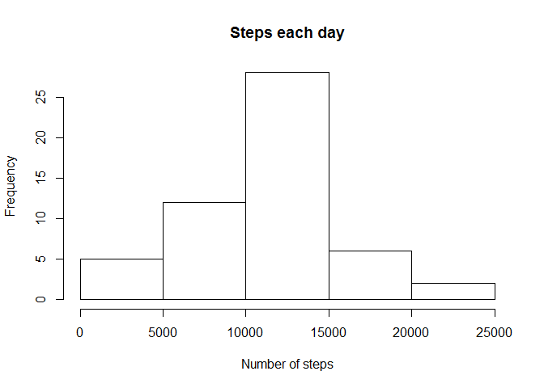
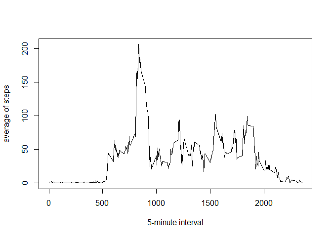
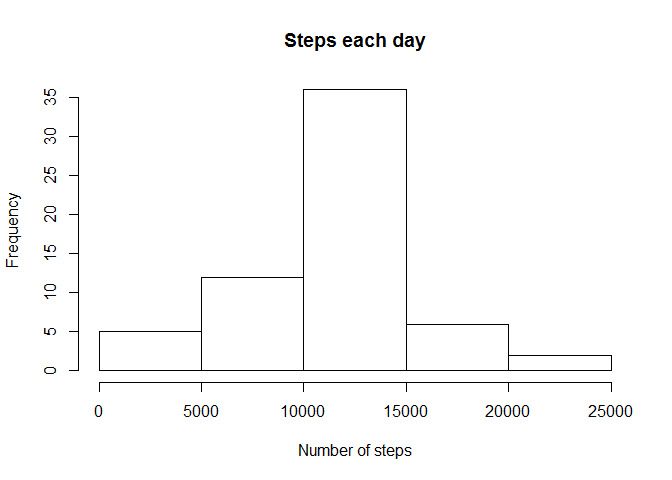

## 1-Loading and preprocessing the data  
  

```r
# Download and read data
url <- "https://d396qusza40orc.cloudfront.net/repdata%2Fdata%2Factivity.zip"
download.file(url,destfile = "activity.zip")
t1 <- read.table(unz("activity.zip","activity.csv"), header=T, sep=",")
```


```r
# Transform data to table dataframe and remove NA
library(dplyr)
```

```
## 
## Attaching package: 'dplyr'
```

```
## The following objects are masked from 'package:stats':
## 
##     filter, lag
```

```
## The following objects are masked from 'package:base':
## 
##     intersect, setdiff, setequal, union
```

```r
t2 <- tbl_df(t1)
t3 <- t2[complete.cases(t2), ]
```
  
  
## 2-What is mean total number of steps per day?  
  
### Histogram of the total number of steps taken each day.

```r
t4 <- t3%>%
    group_by(date) %>%
    summarise(stepseachday=sum(steps))
hist(t4$stepseachday,xlab = "Number of steps", main = "Steps each day")
```

<!-- -->

### Median and mean of all steps taken per day

```r
summarise(t4, median=median(stepseachday),mean=mean(stepseachday))
```

```
## # A tibble: 1 x 2
##   median   mean
##    <int>  <dbl>
## 1  10765 10766.
```
  
  
## 3-What is the average daily activity pattern?    
  
### Time series plot of the 5-min interval and the average number of steps across all days.

```r
t5 <- t3%>%
    group_by(interval) %>%
    summarise(av=mean(steps))
with(t5,plot(interval,av,type = "l",xlab = "5-minute interval",ylab = "average of steps"))
```

<!-- -->
  
### 5 minute interval with the maximum number of steps on average.

```r
t6 <- arrange(t5, desc(av))
t6[1,1]
```

```
## # A tibble: 1 x 1
##   interval
##      <int>
## 1      835
```
   
  
## 4-Imputing missing values  
  

```r
## Calculate the number of missing values in the dataset
v1 <- is.na(t1[,1])
sum(v1,na.rm = TRUE)
```

```
## [1] 2304
```

```r
## Fill in the missing values with the mean of the steps for 5-minute interval.
t7 <- merge(x=t2,y=t5,by="interval")
t8 <- t7%>%
    mutate(steps=as.double(steps)) %>%
    mutate(steps = case_when(is.na(steps)==TRUE~av,
                              TRUE~steps)) %>%
    select(steps,date,interval)
```
  
### Histogram of the total number of steps taken each day

```r
t9 <- t8%>%
    group_by(date) %>%
    summarise(stepseachday=sum(steps))
hist(t9$stepseachday,xlab = "Number of steps", main = "Steps each day")
```

<!-- -->
  
### Median and mean of all steps taken per day

```r
summarise(t9, median=median(stepseachday),mean=mean(stepseachday))
```

```
## # A tibble: 1 x 2
##   median   mean
##    <dbl>  <dbl>
## 1 10766. 10766.
```
  
**These values don't differ from the values taken without missing values.**
  
  
## 5-Are there difference in activity patterns between weekdays and weekends?  
  

```r
##Create a new factor variable with the levels "weekday" and "weekend" 
library(lubridate)
```

```
## 
## Attaching package: 'lubridate'
```

```
## The following object is masked from 'package:base':
## 
##     date
```

```r
t10 <- t8%>%
    mutate(date=as.Date(date)) %>%
    mutate(typeday=wday(date))

t10<- tbl_df(t10)

tweekday <- t10 %>%
    filter(typeday %in% c(2,3,4,5,6)) %>%
    group_by(interval)%>%
    summarise(av=mean(steps)) %>%
    mutate(typeday="weekday")

tweekend <- t10%>%
    filter(typeday %in% c(1,7))%>%
    group_by(interval)%>%
    summarise(av=mean(steps))%>%
    mutate(typeday="weekend")

t11<- bind_rows(tweekday,tweekend)
t12<-mutate(t11,typeday=as.factor(typeday))
```
  
### Panel plot containing a time series plot of the 5-minute interval and the average of the number of steps taken, averaged across all weekday days or weekend days.

```r
library(lattice)
xyplot(av~interval|typeday,data=t12,layout=c(1,2),type="l",xlab="Interval",ylab="Number of steps")
```

<!-- -->


